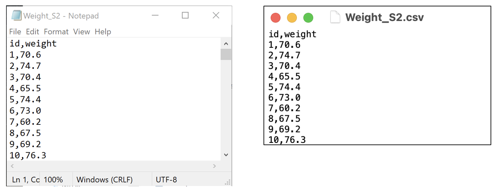

```{r message=FALSE, warning=FALSE, include=FALSE}
library(jmv)
```

### Producing a one-way frequency table

We have three categorical variables to summarise in our PBC Table 1: sex, stage and vital status. These variables are best summarised using one-way frequency tables, which can be constructed using the `descriptives` function from the `jmv` package, with the `freq = TRUE` option. Before constructing frequency tables however, we *must define the variables as categorical variables*, by converting them to *factors*.

#### Defining categorical variables as factors {#sec-cat-as-factors}

To define a categorical variable as such in R, we define it as a **factor** using the factor function:

`factor(variable=, levels=, labels=)`

We specify:

-   levels: the values the categorical variable can take
-   labels: the labels corresponding to each of the levels (entered in the same order as the levels)

To define our variable `sex` as a factor, we use:

```{r}
pbc <- readRDS("data/activities/mod01_pbc.rds")

pbc$sex <- factor(pbc$sex,
    levels = c(1, 2),
    labels = c("Male", "Female")
)
```

We can then produce a frequency table:

```{r}
descriptives(data = pbc, vars = sex, freq = TRUE)
```

> Task: define `stage` and `status` (Vital Status) as factors, and produce one-way frequency tables. Refer to the file `pbc_info.txt` to view the labels for each variable. For example, for Stage:

```{r}
pbc$stage <- factor(pbc$stage,
    levels = c(1, 2, 3, 4),
    labels = c("Stage 1", "Stage 2", "Stage 3", "Stage 4")
)
```

### Producing a two-way frequency table

To produce tables summarising two categorical variables, we can use the `contTables()` function within the `jmv` package. The minimal inputs to include are `data`: the name of the data frame to be analysed, `rows`: the variable representing the rows of the table, and `cols`: the name of the columns of the table.

For example, to produce a two-way table showing stage of disease by sex using the pbc data frame, we use:

```{r}
contTables(data = pbc, rows = sex, cols = stage)
```

[The bottom part of the output, χ² Tests, can be ignored for now]

You may notice in the above that the number of observations is now 412. This is because there are missing observations for either sex or stage: which is it, and how would you determine this?

From the cross-tabulation, you can see the individual frequencies of participants in each of the categories in each cell. For example, there are 3 male participants who have Stage 1 disease. You can also read the totals for each row and column. For example, there are 44 males, and 144 participants have Stage 4 disease.

You can also add percentages into your table using `pcCol=TRUE` to include column percents, and `pcRow=TRUE` for row percents. For example, to calculate the relative frequencies (i.e. percentages) of sex within each stage, we would request **column percents** with the option: `pcCol=TRUE`.

```{r}
contTables(data = pbc, rows = sex, cols = stage, pcCol = TRUE)
```

We can see that the 3 male participants with Stage 1 disease represent 14% of those with Stage 1 disease.

## Creating bar charts for one categorical variable

The simplest way to use the `plot()` function is by specifying an object to be plotted. To plot a single variable from a data frame, we must define it using: `dataframe$variable`.

Here we will create the bar chart shown in @fig-bar-1 of the statistics notes using the `mod01_pdc.rds` dataset. The x-axis of this graph will be the stage of disease, and the y-axis will show the number of participants in each category.

```{r}
plot(pbc$stage,
    main = "Bar graph of stage of disease from PBC study",
    ylab = "Number of participants"
)
```

Note that stage is a categorical variable, that has been defined as a factor (in @sec-cat-as-factors). You **must define categorical data as factors** to plot them in a bar graph.

## Creating bar charts for two categorical variables

### Option 1: Using the contTables function

Creating a **clustered bar chart** as shown in @fig-bar-2 can be done easily using the `contTables` function in the `jmv` package. First create a cross-tab from the variables to be plotted, for example, Stage by Sex:

```{r}
contTables(data = pbc, rows = sex, cols = stage)
```


Creating a **clustered bar chart** as shown in @fig-bar-2 can be done by requesting a bar chart (`barplot=TRUE`), and the x-axis should be constructed from `stage` - that is, the **column** variable:

```{r}
contTables(pbc,
    rows = sex, cols = stage,
    barplot = TRUE, xaxis = "xcols"
)
```

If you want the x-axis to be constructed from the row variable, you would use `xaxis = "xrows"`.

To create a **stacked bar chart** (as in @fig-bar-3), specify `bartype` to be `stack`:

```{r}
contTables(pbc,
    rows = sex, cols = stage,
    barplot = TRUE, xaxis = "xcols", bartype = "stack"
)
```

Finally, to create a **stacked relative bar chart** (as in @fig-bar-4), specify the y-axis to be a percent (`yaxis="ypc"`), and the percentage be calculated from the columns of the frequency table (`yaxisPc = "column_pc"`):

```{r}
contTables(pbc,
    rows = sex, cols = stage,
    barplot = TRUE, bartype = "stack", xaxis = "xcols",
    yaxis = "ypc", yaxisPc = "column_pc"
)
```

### Option 2: Using surveyPlot function

An alternative way of producing barcharts is via a package called `surveymv`. Unfortunately, surveymv is not hosted on the standard package repository, we need to install the package from github.com. This is a straight-forward process, which involves installing a package called `devtools` that allows packages to be installed from alternative locations:

```{r}
#| eval: false
#| include: true

install.packages("devtools")
library(devtools)
install_github("raviselker/surveymv")
```

These commands have installed the `surveymv` package. We load the packing using the standard `library()` command:

```{r}
#| eval: false
#| include: true

library(surveymv)
```

`surveymv` has only one function: `surveyPlot`, with the following syntax:

```
surveyPlot(
  data = babies,
  vars = "Birth weight",
  group = "Age group",
  type = "stacked",
  freq = "perc")
```

We specify our data (`data=`), and the main variable to be plotted (`vars=`). If we have a grouping variable, we specify a `group=` variable. We define the chart to be either a stacked (`type = "stacked"`) or clustered (`type = "grouped"`) bar chart, and specify whether to plot frequencies (`freq = "count"`) or percentages (`freq = "perc"`).

To demonstrate, we will recreate @fig-bar-4, a figure of the relative frequencies of sex within stage of disease:

```{r message=FALSE}
library(surveymv)

surveyPlot(
  data = pbc,
  vars = "sex",
  group = "stage",
  type = "stacked",
  freq = "perc")
```

While this produces a bar chart with horizontal bars, it often performs better with labelling of the groups than the previous method.

## Importing data into R

We have described previously how to import data that have been saved as R .rds files. It is quite common to have data saved in other file types, such as Microsoft Excel, or plain text files. In this section, we will demonstrate how to import data from other packages into R.

There are two useful packages for importing data into R: `haven` (for data that have been saved by jamovi, SAS or SPSS) and `readxl` (for data saved by Microsoft Excel). Additionally, the `labelled` package is useful in working with data that have been labelled in jamovi.

### Importing plain text data into R

A `csv` file, or a "comma separated variables" file is commonly used to store data. These files have a very simple structure: they are plain text files, where data are separated by commas. csv files have the advantage that, as they are plain text files, they can be opened by a large number of programs (such as Notepad in Windows, TextEdit in MacOS, Microsoft Excel - even Microsoft Word). While they can be opened by Microsoft Excel, they can be opened by many other programs: the csv file can be thought of as the lingua-franca of data.

In this demonstration, we will use data on the weight of 1000 people entered in a csv file called `mod02_weight_1000.csv` available on Moodle.

To confirm that the file is readable by any text editor, here are the first ten lines of the file, opened in Notepad on Microsoft Windows, and TextEdit on MacOS.

```{r , echo=FALSE, out.width = "66%",}

```

We can use the `read.csv` function:

```{r}
sample <- read.csv("data/examples/mod02_weight_1000.csv")
```

Here, the `read.csv` function has the default that the first row of the dataset contains the variable names. If your data do not have column names, you can use `header=FALSE` in the function.

Note: there is an alternative function `read_csv` which is part of the `readr` package (a component of the `tidyverse`). Some would argue that the `read_csv` function is more appropriate to use because of an issue known as `strings.as.factors`. The `strings.as.factors` default was removed in R Version 4.0.0, so it is less important which of the two functions you use to import a `.csv` file. More information about this issue can be found [here](https://simplystatistics.org/posts/2015-07-24-stringsasfactors-an-unauthorized-biography) and [here](https://developer.r-project.org/Blog/public/2020/02/16/stringsasfactors/).

## Recoding data {#sec-recoding-data}

One task that is common in statistical computing is to recode variables. For example, we might want to group some categories of a categorical variable, or to present a continuous variable in a categorical way.

In this example, we can use the `pbc` data and recode age into age groups:

-   Less than 30
-   30 to less than 50
-   50 to less than 70
-   70 or older

The quickest way to recode a continuous variable into categories is to use the `cut` command which takes a continuous variable, and "cuts" it into groups based on the specified "cutpoints"

```{r}
pbc$agegroup <- cut(pbc$age,
    breaks = c(0, 30, 50, 70, 100)
)
```

Notice that some numbers need to be defined for the lowest (age=0) and highest (age=100) bounds: both a lower and upper limit must be defined for each group.

If we examine the new `agegroup` variable:

```{r}
summary(pbc$agegroup)
```

we see that each group has been labelled in the form of (a, b]. This notation is equivalent to: greater than a, and less than or equal to b. The `cut` function excludes the lower limit, but includes the upper limit. Our age groups have been defined to include the lower limit, and exclude the upper limit (for example, greater than or equal to 30 and less than 50).

We can specify this recoding using the `right=FALSE` option:

```{r}
pbc$agegroup <- cut(pbc$age,
    breaks = c(0, 30, 50, 70, 100),
    right = FALSE
)

summary(pbc$agegroup)
```

Finally, we can specify labels for the groups using the `labels` option:

```{r}
pbc$agegroup <- cut(pbc$age,
    breaks = c(0, 30, 50, 70, 100),
    right = FALSE,
    labels = c(
        "Less than 30", "30 to less than 50",
        "50 to less than 70", "70 or more"
    )
)

summary(pbc$agegroup)
```

## Computing binomial probabilities using R {#sec-binom-r}

There are two R functions that we can use to calculate probabilities based on the binomial distribution: `dbinom` and `pbinom`:

-   `dbinom(x, size, prob)` gives the probability of obtaining `x` successes from `size` trials when the probability of a success on one trial is `prob`;
-   `pbinom(q, size, prob)` gives the probability of obtaining `q` **or fewer** successes from `size` trials when the probability of a success on one trial is `prob`;
-   `pbinom(q, size, prob, lower.tail=FALSE)` gives the probability of obtaining **more than** `q`successes from `size` trials when the probability of a success on one trial is `prob`.

To do the computation for part (a) in Worked Example 2.1, we will use the `dbinom` function with:

-   *x* is the number of successes, here, the number of smokers (i.e. k=3);
-   *size* is the number of trials (i.e. n=6);
-   and *prob* is probability of drawing a smoker from the population, which is 19.8% (i.e. p=0.198).

Replace each of these with the appropriate number into the formula:

```{r}
dbinom(x = 3, size = 6, prob = 0.198)
```

To calculate the upper tail of probability in part (b), we use the `pbinom(lower.tail=FALSE)` function. Note that the `pbinom(lower.tail=FALSE)` function **does not include `q`**, so to obtain 4 or more successes, we need to enter `q=3`:

```{r}
pbinom(q = 3, size = 6, prob = 0.198, lower.tail = FALSE)
```

For the lower tail for part (c), we use the `pbinom` function:

```{r}
pbinom(q = 2, size = 6, prob = 0.198)
```

::: {.callout-note}

## Note

In this section, we introduce `ggplot2` which is a very flexible method of plotting data in R. The use of `ggplot2` is **completely optional**. It is perfectly fine to produce graphs using the simpler methods, as long as they are formatted appropriately.

:::

## Introducing `ggplot2`

Plots produced by `plot(dens())` and `boxplot()` are often called `base` graphics: no special packages have been needed to produce these plots. In this section, we will introduce the `ggplot2` [^1] package, which defines plots using a **grammar of graphics**. This can seem like a complex way of constructing a plot, but the framework allows for very complex plots to be constructed in a relatively consistent way.

The grammar of graphics defines a number of elements of a plot; the key elements that we will use in this course are:

- data: we need to specify the data we are plotting. The data must be stored as a dataframe, where variables are organised in columns, and observations are in rows
- mapping: the *aesthetic mapping* describes how your data map to visual properties of the plot. For example, we might want to define the x-axis by the `age` variable and the colour of points by `sex`. We can define our mapping using the command `mapping = aes()`, and entering the specific aesthetic components within the `aes()` component.
- geometries: we can think of *geometries* as defining the actual "ink" of the plot, modified by the *aesthetics* defined by the mapping. For example:
  - `geom_bar()` will plot a bar-chart;
  - `geom_boxplot()` will plot a boxplot;
  - `geom_histogram()` will plot a histogram.
- theme: the *theme* defines the overall look of the plot. Every part of the plot that is not specified by data can be adjusted by changing the theme. For example, fonts, axis ticks, legend position and background colours can all be changed by using a theme. Some useful themes are:
  - `theme_bw()`: a black-and-white theme
  - `theme_minimal()`: a clean them with no background annotations
  - `theme_classic()`: a theme that removes grid-lines and backgrounds, leaving only axis lines.

These elements can be combined in a single `ggplot` command by using a `+` symbol, usually with each element provided on a new line.

### Using `ggplot2` to construct a bar chart

As a demonstration, we will produce the simplest bar chart possible: a bar chart of `sex`.

First, we will load the `ggplot2` library, and call the `ggplot` function with no function arguments.

```{r}
library(ggplot2)

ggplot()
```

In this example, all `ggplot` has done is to create a blank canvas. Let's start filling the canvas in by specifying our dataset, and defining sex as our x-axis:

```{r}
ggplot(data=pbc, mapping = aes(x=sex))
```

Our blank canvas has been altered: we now have an x-axis, defined by `sex`, with values of `Male` and `Female`.

To add "ink" to our canvas, we now need to add a *geometry*. For a bar chart, we use `geom_bar()` as follows:

```{r}
ggplot(data=pbc, mapping = aes(x=sex)) +
  geom_bar()
```

We can change the look of the figure by choosing a different *theme*: let's use `theme_classic()` here.

```{r}
ggplot(data=pbc, mapping = aes(x=sex)) +
  geom_bar() +
  theme_classic()
```

The final changes we can make are to define the axis labels using `labs()`:

```{r}
ggplot(data=pbc, mapping = aes(x=sex)) +
  geom_bar() +
  theme_classic() +
  labs(x = "Participant sex", 
       y = "Frequency")
```

Finally, we can change the colour of the bars by specifying a `fill` colour within the `geom_bar()` command. We can choose one of over 600 (!) colours by name [^2].

```{r}
ggplot(data=pbc, mapping = aes(x=sex)) +
  geom_bar(fill="steelblue") +
  theme_classic() +
  labs(x = "Participant sex", 
       y = "Frequency")
```

Let's adapt this code to produce a bar chart for stage of disease:

```{r}
ggplot(data=pbc, mapping = aes(x=stage)) +
  geom_bar(fill="steelblue") +
  theme_classic() +
  labs(x = "Stage of disease", 
       y = "Frequency")
```

Note that `ggplot` has included a separate bar for the missing values (i.e. the `NA` values). We can instruct R to ignore the missing values in the `ggplot` function by specifying the data to be a `subset` of `pbc`. The command: `subset(pbc, is.na(stage) == FALSE)` essentially creates a temporary subset of the `pbc` dataset where `stage` is not missing. Putting it all together:

```{r}
ggplot(data=subset(pbc, is.na(stage) == FALSE), mapping = aes(x=stage)) +
  geom_bar(fill="steelblue") +
  theme_classic() +
  labs(x = "Stage of disease", 
       y = "Frequency")
```

## Introducing the "pipe" `|>`

Consider the previous example, which essentially combines two functions: `ggplot()` and `subset()` by using: `ggplot(subset())` - in other words, `subset()` has been nested within `ggplot()`. When R comes across nested functions, it will happily run the inner-most function first, then applies the outer function to the result of the inner function.

While this code is understandable by R, one could argue this code is difficult to understand for a person. A more interpretable version of this code for a person would be:

- first run the `subset()` function, **and then**
- run the `ggplot()` function.

This can be rewritten using the `|>` symbol:

```
subset() |> 
  ggplot()
```

This syntax would "pipe" the results of the first function into the second function, and produces code that is much easier for a person to read. So our previous bar chart of stage of disease can be rewritten as:

```{r}
subset(pbc, is.na(stage) == FALSE) |> 
  ggplot(mapping = aes(x=stage)) +
    geom_bar(fill="steelblue") +
    theme_classic() +
  labs(x = "Stage of disease", 
       y = "Frequency")
```

Notice that when we pipe a dataset from the `subset()` function, we no longer need to specify the name of the dataset in `ggplot()`: the dataset is inferred from the action of the `subset()` function.

::: {.callout-note}

- The `|>` pipe was introduced in R version 4.1.0, May 2021, and for this author (TD), has drastically improved the code that I write (and read!). When reading code that I, or others, have written using the pipe, I replace `|>` by the words **and then**. So the previous code would be read: subset the data **and then** plot the data.

- You may also see `%>%` referred to as a pipe. This version of the pipe was introduced in the early 2010s, most notably in the `magrittr` package. While there are subtle differences between `|>` and `%>%`, the `|>` is the easier to use for this course, as it does not require loading any additional packages. More in-depth history can be found at [this blog post](http://adolfoalvarez.cl/blog/2021-09-16-plumbers-chains-and-famous-painters-the-history-of-the-pipe-operator-in-r/).
:::

### Using `ggplot2` to construct bar charts for two variables

In @sec-two-catvar-graph, we saw that clustered or stacked bar charts can be used to summarise two categorical variables. Remember that the *aesthetic mapping* can be used to describe how our data map to visual elements of our plot. So we can map `sex` to the `fill` attribute to summarise Stage of Disease by sex. By default, `ggplot` will produce a stacked bar chart, but we can request a clustered bar chart by specifying `position="dodge"` in the `geom_bar()` statement:

```{r}
subset(pbc, is.na(stage) == FALSE) |> 
  ggplot(mapping = aes(x=stage, fill=sex)) +
    geom_bar(position = "dodge") +
    theme_classic() +
  labs(x = "Stage of disease", 
       y = "Frequency")
```

Notice that the legend title uses the name of the `fill` variable, in this case `sex` with a lower-case s. We can specify an alternative legend title in the `labs()` statement:

```{r}
subset(pbc, is.na(stage) == FALSE) |> 
  ggplot(mapping = aes(x=stage, fill=sex)) +
    geom_bar(position = "dodge") +
    theme_classic() +
  labs(x = "Stage of disease", 
       y = "Frequency",
       fill = "Sex")
```

A stacked bar chart can be constructed by removing the `position = dodge()` statement:

```{r}
subset(pbc, is.na(stage) == FALSE) |> 
  ggplot(mapping = aes(x=stage, fill=sex)) +
    geom_bar() +
    theme_classic() +
  labs(x = "Stage of disease", 
       y = "Frequency",
       fill = "Sex")
```

Finally, we can construct a stacked relative bar chart by specifying `position = "fill"` in the `geom_bar()` definition:

```{r}
subset(pbc, is.na(stage) == FALSE) |> 
  ggplot(mapping = aes(x=stage, fill=sex)) +
    geom_bar(position = "fill") +
    theme_classic() +
  labs(x = "Stage of disease", 
       y = "Proportion",
       fill = "Sex")
```

## Producing a density plot using ggplot

We can produce a density plot by specifying the variable of interest as the `x` variable, and requesting a `geom_density()`:

```{r}
ggplot(data=pbc, aes(x=age)) + 
  geom_density() +
  theme_classic() +
  labs(x="Age (years)",
       y="Density")
```

## Producing a boxplot using ggplot

A boxplot is constructed with a single `y` variable, and `geom_boxplot()`:

```{r}
ggplot(data=pbc, aes(y=age)) + 
  geom_boxplot() +
  theme_classic() +
  labs(y="Age (years)")
```

By default, `ggplot2` includes arbitrary values on the x-axis. As boxplots are usually constructed only for informal data investigation, and are rarely included in formal documents, the x-axis labelling may not be an issue. However, the x-axis labelling can be removed as follows:

```{r}
ggplot(data=pbc, aes(y=age)) + 
  geom_boxplot() +
  theme_classic() +
  labs(y="Age (years)") +
  theme(
    axis.title.x = element_blank(),
    axis.text.x = element_blank(),
    axis.ticks.x = element_blank()
  )
```


[^1]: Note that the package is called `ggplot2` as it is a complete overhaul of the package called `ggplot`. The main function used in the `ggplot2` package is `ggplot()`. This can be confusing, but you will get used to this in time.
[^2]: A list of available colours that can be used in `ggplot` can be found by entering the command `grDevices::colours()` in R, or by searching the web for `R colour names`.


