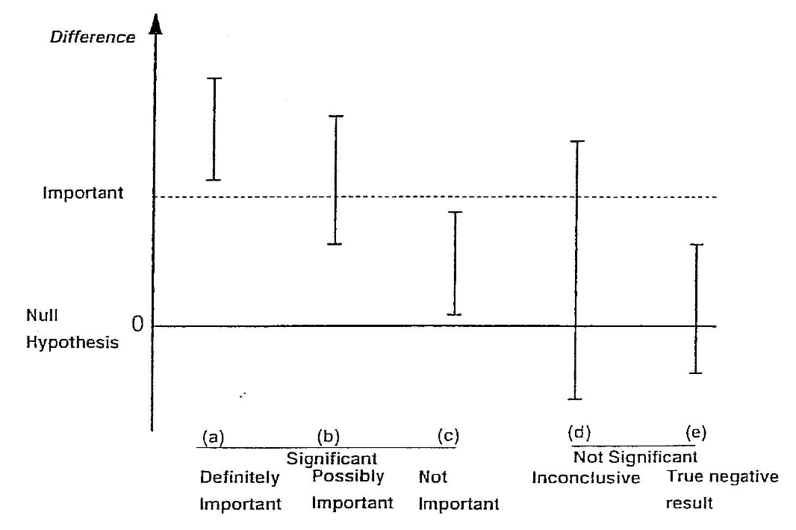

```{r include=FALSE}
library(flextable)
```

# An introduction to hypothesis testing

## Learning objectives {-}

By the end of this module you will be able to:

- Formulate a research question and present it as a null and alternative hypothesis;
- Understand the role of confidence intervals in assessing research questions;
- Explain the general framework of hypothesis testing;
- Interpret P-values as measures of evidence;
- Distinguish between statistical significance and practical importance;
- Perform and interpret a one-sample t-test;
- Explain the concepts of one-tailed and two-tailed statistical tests, and determine when each is appropriate;
- Report the results of hypothesis tests clearly, accurately, and in plain language.

## Optional readings {-}

@kirkwood_sterne01; Chapter 8. [[UNSW Library Link]](http://er1.library.unsw.edu.au/er/cgi-bin/eraccess.cgi?url=https://ebookcentral.proquest.com/lib/unsw/detail.action?docID=624728)

@bland15; Sections 9.1 to 9.7; Sections 10.1 and 10.2. [[UNSW Library Link]](http://er1.library.unsw.edu.au/er/cgi-bin/eraccess.cgi?url=https://ebookcentral.proquest.com/lib/unsw/detail.action?docID=5891730)

## Introduction

In earlier modules, we examined sampling and how summary statistics can be used to make inferences about a population parameter. For example, we can use the sample mean $\bar{x}$ to make inferences about $\mu$, the true mean of the population from which a sample is drawn. In this module, we introduce hypothesis testing as the basis of the statistical tests that are important for reporting results from research and surveillance studies, and that you will be learning in the remainder of this course.

We use hypothesis testing to answer questions such as whether two groups have different health outcomes or whether there is an association between a treatment and a health outcome. For example, we may want to know:

-	whether a safety program has been effective in reducing injuries in a factory, i.e. whether the frequency of injuries in the group who attended a safety program is lower than in the group who did not receive the safety program;
-	whether a new drug is more effective in reducing blood pressure than a conventional drug, i.e. whether the mean blood pressure in the group receiving the new drug is lower than the mean blood pressure in the group receiving the conventional medication;
-	whether an environmental exposure increases the risk of a disease, i.e. whether the frequency of disease is higher in the group who have been exposed to an environmental factor than in the non-exposed group.

We may also want to know something about a single group. For example, whether the mean blood pressure of a sample is the same as the general population.

These questions can be answered by setting up a null hypothesis and an alternative hypothesis, and performing a hypothesis test (also known as a significance test). In this module we focus on testing hypotheses about a single population mean, using confidence intervals and the one-sample t-test.

### Worked example

In this module, we will revisit the Pima example from Module 3 (`mod03_blood_pressure.csv`). A sample of 733 female Pima indigenous Americans was taken, and their diastolic blood pressure was measured (among other measures). We saw in Module 3 that a density plot demonstrates that the data are approximately normally distributed, and the mean diastolic blood pressure was estimated as 72.4 mmHg with a 95% confidence interval from 71.5 to 73.3 mmHg.

## Research questions

A research question is an open, neutral question that states what we want to find out - often phrased using everyday language. Research questions guide study design and data collection, and do not presuppose an answer. Using our Pima example, a research question could be posed:

- Do Pima women have the same mean diastolic blood pressure as the general US population?

A useful way of structuring research questions in health research is the PECO framework:

- Population: Who is being studied?
- Exposure: What exposure, risk factor, or condition is of interest?
- Comparator: What is the exposure being compared against?
- Outcome: What outcome is being measured?

In the example above:

- Population: Pima women
- Comparator: General US population
- Outcome: Diastolic blood pressure

Note there as there is only one group here, there is no "exposure".

## Using confidence intervals to assess research questions

We can use the 95% confidence interval to **informally** assess research questions. For example, we can use a 95% confidence interval for the mean to assess whether the population mean is consistent with a hypothesised value. A confidence interval gives a range of plausible values for the true population mean, based on the sample data, and we can compare the confidence interval with the hypothesised value.

If a hypothesised mean lies:

- *outside* the confidence interval, there is *informal evidence* that the population mean differs from the hypothesised mean
- *inside* the confidence interval, there is *no informal evidence* that the population mean differs from the hypothesised mean

Note that a confidence interval does not provide a quantitative measure of evidence against a null hypothesis; it supports only an informal comparison. Formal hypothesis testing is required to quantify the level of evidence.

## Hypothesis testing

In statistics, a hypothesis is a claim about a population parameter. Hypothesis testing is a formal procedure used to decide between two competing claims about a population parameter. These two claims are known as:

- the **null hypothesis**
- the **alternative hypothesis**

Hypothesis testing is a statistical technique that is used to quantify the evidence against a null hypothesis.

The **null hypothesis**, written H~0~, represents the hypothesis of no difference, no change, no effect. It is often described as the *boring* or *skeptical* hypothesis

The **alternative hypothesis**, written H~A~, represents the hypothesis of a difference, change or effect.

Note that hypotheses always refer to a **population**, not a sample.

### Example

In our example, our research question is: do Pima women have the same mean diastolic blood pressure as the general US population?

To test this research question, we will need a value for the mean diastolic blood pressure of the general US population. We will use the results from a large-scale population survey, and state that the US population has a mean diastolic blood pressure of 71mmHg.

Our hypotheses then, could be written as:

- H~0~: $\mu = 71$
- H~A~: $\mu \ne 71$

where $\mu$ is the true population mean diastolic blood pressure of Pima women.

These hypotheses are very formal, and it may be easier to think of them as:

- H~0~: The mean diastolic blood pressure of Pima women is 71 mmHg.
- H~A~: The mean diastolic blood pressure of Pima women is not 71 mmHg.

## The hypothesis testing framework

The recommended steps in a hypothesis test are as follows:

0. Exploratory data analysis
    - examine distributions, check for missing and/or unusual data
    - understand the structure of the data (sample size, groups, variables)
    - based on above, choose an appropriate statistical test
    - check the assumptions required for the chosen test
    - frame the research question using the PECO framework:
        - Population, Exposure, Comparator, Outcome
1. Specify the Null and Alternative Hypotheses
2. Perform the statistical test, and obtain test statistic, degrees of freedom and P-value
3. Calculate descriptive statistics
4. Summarise the results including
    - Summary statistics (overall or by group)
    - A statement about the evidence
    - Estimate of effect including:
        - Direction
        - Point estimate
        - 95% confidence interval
5. Provide a clear and concise conclusion, written in plain English, that summarises the results of the study in terms of the wider population, not just the sample

## The test statistic

After setting up our null and alternative hypotheses, we use the data to generate a test statistic. The particular test statistic differs depending on the type of data being analysed (e.g. continuous or categorical), the study design (e.g. paired or independent) and the question being asked.

The test statistic is then compared to a known distribution to calculate the probability of observing a test statistic which is as large or larger than the observed test statistic, if the null hypothesis was true. The probability is known as the P-value.

## The P-value

Formally, the P-value is interpreted as the probability of observing data like ours, or more extreme, if the null hypothesis was true.

If the P-value is small, it is unlikely that we would observe data like ours or more extreme if the null hypothesis was true. In other words, our data are not consistent with the null hypothesis, and we conclude that we have evidence against the null hypothesis. If the P-value is not small, the probability of observing data like ours or more extreme is not unlikely. We therefore have little or no evidence against the null hypothesis. In hypothesis testing, the null hypothesis cannot be proven or accepted; we can only find evidence to refute the null hypothesis.

To summarise: 

-	a small P-value gives us evidence against the null hypothesis;
-	a P-value that is not small provides little or no evidence against null hypothesis;
-	the smaller the P-value, the stronger the evidence against the null hypothesis.

Historically, a value of 0.05 has been used as a cut-point for finding evidence against the null hypothesis. A P-value less than 0.05 would be interpreted as "statistically significant", and would allow us to "reject the null hypothesis". A P-value greater than 0.05 would be interpreted as "not significant", and we would "fail to reject the null hypothesis". This arbitrary dichotomy is overly simplistic, and a more nuanced view is now recommended. Recommended interpretations for P-values are given in @tbl-4-1.

```{r tbl-4-1, echo=FALSE}
#| tbl-cap: Interpretation of P-values

tab4_1 <- tibble::tribble(
    ~`P-value`, ~`Strength of evidence`,
    "<0.001", "Very strong evidence",
    "0.001 to <0.01", "Strong evidence",
    "0.01 to <0.05", "Evidence",
    "0.05 to <0.1", "Weak evidence",
    "≥0.1", "Little or no evidence"
)

flextable(tab4_1, cwidth = c(1.5, 2))

```

These days, P-values are usually generated using statistical software. Historically, statistical tables were used to determine the P-value from the test-statistic.

## Effect size

In hypothesis testing, P-values convey only part of the information about the hypothesis and need to be accompanied by an estimation of the effect size. The effect size describes how different our sample is from the hypothesised population parameter. The effect size depends on the study design and the type of outcome variable being analysed, and should always be presented with a 95% confidence interval (where possible).

In our blood pressure example, the sample mean and its 95% confidence interval represent the effect size. Alternatively, the difference between the sample mean and the hypothesised mean (and the 95% confidence interval) could be presented.

Reporting the effect size enables others to judge whether a result that has evidence of a difference is also a practically important finding. The effect size provides information to help others decide whether the observed effect is large and important enough to warrant a change in current health care practice, is equivocal and suggests a need for further research, or is small and practically unimportant.

## Statistical significance vs practical importance

When applying statistical methods in health and medical research, we need to make an informed decision about whether the effect size that led to a statistically significant finding is also practically important (see @fig-practical-importance). The decision about whether a statistically significant result is also practically important depends on expert knowledge, and is best made by others with experience in the field.

{#fig-practical-importance}

It is possible when conducting significance tests, particularly in very large studies, that a small difference provides strong evidence of an effect due to increased precision from large sample sizes. For example, in a large study of over 1000 patients, a new medication may be found to lower blood pressure by an average of 1 mmHg more than a currently accepted drug, providing strong evidence of a difference (P < 0.01). However, such a small reduction in blood pressure would be unlikely to be practically important. The cost and potential side effects of the new medication would need to be weighed against this very small average benefit. In this situation, despite strong statistical evidence, the finding would not be practically important. This is the situation described in scenario (c) of  @fig-practical-importance.

Conversely, it is possible to obtain a large, practically important difference between groups that provides little evidence of a difference. 

For example, consider a small study to measure the rate of hospital admissions following presentation to the Emergency Department. We may find that 80% of children who present to the Emergency Department are admitted before the intervention, compared to only 65% of children after the intervention. However, the P value may be calculated as 0.38, providing no evidence of a difference. This may be because only a small number of participants were recruited in each period. Here, the reduction in the admission rate by 15% represents a practically important difference, but not statistically significant. This situation is represented in scenario (d) of @fig-practical-importance.

The important thing to remember is that statistical significance does not always correspond to practical importance. A statistically significant result may be practically unimportant, and a statistically non-significant results may be practically important.

## Errors in significance testing
There are two conclusions we can draw when conducting a hypothesis test: if the P-value is small, there is strong evidence against the null hypothesis and we reject the null hypothesis. If the P-value is not small, there is little evidence against the null hypothesis and we fail to reject the null hypothesis. As discussed above, the “small” cut-point for the P-value is often taken as 0.05. We refer to this value as $\alpha$ (alpha).

We can conduct a thought experiment and compare our hypothesis test conclusion to reality. In reality, either the null hypothesis is true, or it is false. Of course, if we knew what reality was, we would not need to conduct a hypothesis test. But we can compare our possible hypothesis test conclusions to the true (unobserved) reality.

If the null hypothesis was true in reality, our hypothesis test can fail to reject the null hypothesis – this would be a correct conclusion. However, the hypothesis test could lead us to rejecting the null hypothesis – this would be an incorrect conclusion. We call this scenario a Type I error, and it has a probability of $\alpha$.

The other situation is where, in reality, the null hypothesis is false. A correct conclusion would be where our hypothesis test rejects the null hypothesis. However, if our hypothesis test fails to reject the null hypothesis, we have made a Type II error. The probability of making a Type II error is denoted $\beta$ (beta). We will see in Module 10 that $\beta$ is determined by the size of the study.

The error in falsely rejecting the null hypothesis when it is true (type I error), or in falsely accepting the null hypothesis when it is not true (type II error) is summarised in @tbl-mod4-alpha-beta. We will return to these concepts in Module 10, when discussing how to determine the appropriate sample size of a study.

```{r tbl-mod4-alpha-beta, echo=FALSE}
#| tbl-cap: Comparison of study result with the truth

df <- tibble::tribble(
    ~` `, ~Effect, ~`No effect`,
    "Evidence", "Correct", "ɑ",
    "No evidence", "β", "Correct"
)

flextable(df, cwidth = c(1.5, 1, 1))
```

## One-sample t-test
A one-sample t-test tests whether a sample mean is different to a hypothesised value. The t-distribution and its relation to normal distribution has been discussed in detailed in Module 3.

In a one-sample t-test, a t-value is computed as the sample mean divided by the standard error of the mean. The significance of the t-value is then computed using software, or can be obtained from a statistical table.

The principles of this test can be used for applications such as testing whether the mean of a sample is different from a known population mean, for example testing whether the IQ of a group of children is different from the population mean of 100 IQ points or testing whether the number of average hours worked in an adult sample is different from the population mean of 38 hours.

### Worked Example
The mean diastolic blood pressure (BP) of the general US population is known to be 71 mm Hg. The diastolic blood pressure of 733 female Pima indigenous Americans was measured and a density plot showed that the data were approximately normally distributed. The mean diastolic blood pressure in the sample was 72.4 mm Hg with a standard deviation of 12.38 mm Hg.

We can use jamovi or R to conduct a one sample t-test using the data available on Moodle (`mod04_blood_pressure.csv`). The results from this test are summarised below.


| n   | Mean | Standard deviation | Standard error | 95% confidence interval of the mean |
|-----|------|--------------------|----------------|-------------------------------------|
| 733 | 72.4 | 12.38              | 0.46           | 71.5 to 73.3                        |

: Summary of blood pressure from female Pima indigenous Americans {#tbl-one-sample-ttest}

The test statistic for the one-sample t-test is calculated as t~732~=3.07, with a P-value of 0.002.

The mean diastolic blood pressure of females from Pima is estimated as 72.4 mmHg (95% CI: 71.5 to 73.3 mmHg), which is higher than that of the general US population. Note that this interval does not contain the mean of the general US population (71 mm Hg), providing some indication that the mean diastolic blood pressure of female Pima people is higher than that of the general US population.

The result from the formal hypothesis test gives strong evidence that the mean diastolic BP of the female Pima people is higher than that of the general US population (t~732~=3.07, P=0.002).

## One and two tailed tests
Most statistical tests are two tailed tests, that is, we conduct a test that allows for the summary statistic in the group of interest to be either higher or lower than in the comparison group. For a t-test, this requires that we obtain a two-tailed P value which gives us the probability of the t-value being in either one of the two tails of the t-distribution as shown in @fig-two-tailed-test. The shaded regions show the t values that indicate a P value less than 0.05. 

```{r fig-two-tailed-test, echo=FALSE, out.width = "66%"}
#| fig-cap: P-value for a 2-tailed test

knitr::include_graphics(here::here("img", "mod04", "two-tailed-test.png"))
```

Occasionally, one tailed tests are conducted in which the summary statistic in the group of interest can only be higher or lower than the comparison group, i.e. a difference is specified to occur in one direction only. In most studies, two tailed tests of significance are used to allow for the possibility that the effect size could occur in either direction. In clinical trials, this would mean allowing for a result that can indicate a benefit or an adverse effect in response to a new treatment. In epidemiological studies, two tailed tests are used to allow for the fact that exposure to a factor of interest may be adverse or may be beneficial. This conservative approach is usually adopted to prevent missing important effects that occur in the opposite direction to that expected by the researchers.

## A note on P-values displayed by software
You will often see P-values generated by statistical software presented as 0.000 or 0.0000. As P-values can never be equal to zero, any P-value displayed in this way should be converted to <0.001 or <0.0001 respectively (i.e. replace the last 0 with a 1, and use the less-than symbol).

R can display P-values in a very cryptic way: $\text{6.478546e-05}$ for example. This is translated as: 

$$
\begin{aligned}
6.478546e-05 &= 6.478546 \times 10^{-5} \\
  &= 6.478546 \times 0.00001 \\
  &= 0.00006478546
\end{aligned}
$$

Such a P-value should be presented as P<0.0001.

## Decision Tree
In the following modules in this course, several formal statistical tests will be described to analyse different types of data sets that have been collected to test set null hypotheses. It is important that the correct statistical test is selected to generate P-values and estimate effect size. If an incorrect statistical test is used, the assumptions of the test may be violated, the effect size may be biased and the P value generated may be incorrect. 

Selecting the correct test to use in each situation depends on the study design and the nature of the variables collected. Figure 1 in the Appendix shows a decision tree which enables you to decide the type of test to select based on the nature of the data.



<!-- # Jamovi notes {-} -->

<!--  -->

<!--  -->

<!-- # R notes {-} -->

<!--  -->

<!--  -->

<!-- # Activities {-} -->

<!--  -->

